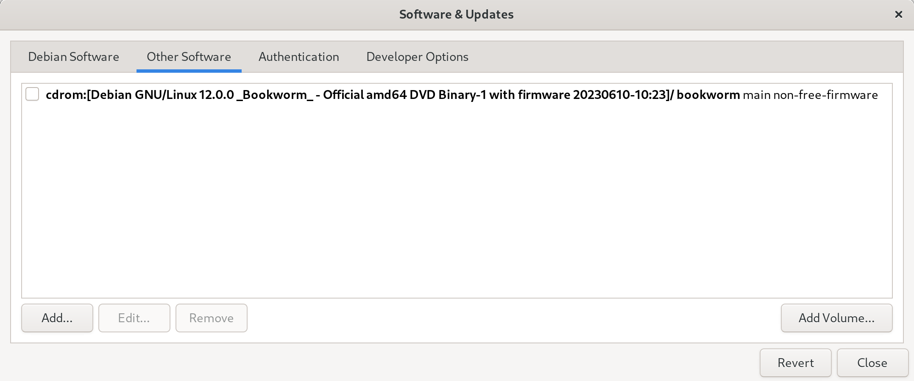

# Developer Workstation Setup Script Debian Edition


This guide provides instructions for setting up a developer workstation using Debian 12 "bookworm". The setup scripts automate the installation of necessary software and configurations.

While the software and setup choices are mainly aimed towards developers, it is also suitable for general use.

## Installation

Before running the setup script, follow these steps to install Debian 12 and configure the desktop environment:

1. Install a fresh copy of Debian 12. Tested with https://cdimage.debian.org/debian-cd/current/amd64/bt-dvd/debian-12.5.0-amd64-DVD-1.iso.torrent

> If you use the default guided partitioner in the Debian installer, [you will get a swap partition of only 1 GB](https://bugs.debian.org/cgi-bin/bugreport.cgi?bug=987503). To get an uncapped swap partition size, in the grub menu before the Debian installer runs, follow these steps:
>
> 1. Press "e" to edit the default installation option.
> 2. In the line that says `linux /install.amd/vmlinuz vga=788 --- quiet`, add the following separated by a space after `vmlinuz`:
>
>    ```sh
>    partman-auto/cap-ram=n
>    ```
>
> 3. Press Ctrl-x or F10 to boot into the text installer which is the same as the GUI version.

Select Gnome as the desktop environment. During the installation, do not provide any details for the root account, your user account will then have administrative rights.

2. Open the terminal and run the following command to install Ansible, Git, and Flatpak:

   ```
   sudo apt install ansible git flatpak
   ```

> If you encounter any issues related to the CD-ROM reference in `/etc/apt/sources.list`, remove it or use the Software and Updates App before proceeding.



3. Clone the repository and navigate to it:

   ```sh
   git clone https://github.com/David-Else/developer-workstation-setup-script-debian
   cd developer-workstation-setup-script-debian
   ```

4. Customize the software selection by modifying the `packages.yml` file according to your preferences.

5. Run the installation playbook:

   ```sh
   ansible-playbook ./install-playbook.yml -K
   ```

   > Note: When prompted for the `BECOME` password in Ansible, enter your user password. Your account must have administrative privileges.

6. Log out and in, then run the Gnome setup:

   ```sh
   ansible-playbook ./gnome-setup-playbook.yml -K
   ```

7. To enable the preview feature in the `nnn` file manager, run it once with the `-a` flag to create the FIFO file.

8. Install keyd:

   ```sh
   cd keyd
   make && sudo make install
   sudo systemctl enable keyd && sudo systemctl start keyd
   ```

9. Install showmethekey:

   ```sh
   cd extras
   unzip showmethekey-1.12.0-compiled.zip
   cd showmethekey-1.12.0-compiled
   sudo install-show-me-the-key.sh
   ```

10. Install Firefox extensions:

   ```sh

   firefox https://addons.mozilla.org/en-GB/firefox/addon/ublock-origin/ \
       https://addons.mozilla.org/en-US/firefox/addon/surfingkeys_ff/ \
       https://addons.mozilla.org/en-US/firefox/addon/copy-selection-as-markdown/ \
       https://addons.mozilla.org/en-US/firefox/addon/keepassxc-browser/ &
   ```

11. Use `bat` instead of `batcat` to stop `nnn` getting confused:

   ```sh
   sudo ln -s /usr/bin/batcat /usr/local/bin/bat
   ```

12. Create a symbolic link for Helix to access debugging:

   ```sh
   cd $(dirname $(which lldb-vscode-15))
   sudo ln -s lldb-vscode-15 lldb-dap
   ```

## Optional Tweaks

Depending on your software selection, hardware, and personal preferences, you may want to make the following changes:

### Audio

To set the available sample rates for your audio interface, follow these steps:

1. Find your audio interface(s) and available sample rates by running the following command:

   ```sh
   cat /proc/asound/cards
   ```

   Example output:

   ```sh
   0 [HDMI]: HDA-Intel - HDA ATI HDMI
              HDA ATI HDMI at 0xf7e60000 irq 31
   1 [USB ]: USB-Audio - Scarlett 6i6 USB
                         Focusrite Scarlett 6i6 USB at usb-0000:00:14.0-10, high speed
   ```

2. Play some audio and examine the stream for your audio interface (in this case `card1`) by running the following command \*note this might not work:

   ```sh
   cat /proc/asound/card1/stream0
   ```

   Example output:

   ```sh
   Focusrite Scarlett 6i6 USB at usb-0000:00:14.0-10, high speed : USB Audio

   Playback:
     Status: Running
       Interface = 1
       Altset = 1
       Packet Size = 216
       Momentary freq = 48000 Hz (0x6.0000)
       Feedback Format = 16.16
     Interface 1
       Altset 1
       Format: S32_LE
       Channels: 6
       Endpoint: 0x01 (1 OUT) (ASYNC)
       Rates: 44100, 48000, 88200, 96000, 176400, 192000
       Data packet interval: 125 us
       Bits: 24
       Channel map: FL FR FC LFE RL RR
       Sync Endpoint: 0x81 (1 IN)
       Sync EP Interface: 1
       Sync EP Altset: 1
       Implicit Feedback Mode: No
   ```

   You can view the current playback sample-rate with:

   ```sh
   cat /proc/asound/card1/pcm0p/sub0/hw_params
   ```

3. Create a PipeWire user config file by running the following commands:

   ```sh
   mkdir -p ~/.config/pipewire/
   cp /usr/share/pipewire/pipewire.conf ~/.config/pipewire/
   ```

4. Edit the `~/.config/pipewire/pipewire.conf` file to add or modify the available sample rates for your sound card(s). Replace the default line with the desired sample rates, removing the `#` comment:

   ```sh
   default.clock.allowed-rates = [ 44100 48000 88200 96000 176400 192000 ]
   ```

   You can confirm the settings were changed with:

   ```sh
   systemctl --user restart pipewire.service
   pw-metadata -n settings
   ```

   and watch the sample rates change per application running `pw-top`.

   > More info can be found at: [docs.pipewire.org configuration-file-pipewireconf](https://gitlab.freedesktop.org/pipewire/pipewire/-/wikis/Config-PipeWire#configuration-file-pipewireconf)

5. Create a user config file for your PipeWire JACK settings by running the following commands:

   ```sh
   mkdir -p ~/.config/pipewire/jack.conf.d/
   cat >~/.config/pipewire/jack.conf.d/jack.conf <<EOF
   jack.properties = {
        node.latency       = 512/96000
        node.rate          = 1/96000
        node.quantum       = 512/96000
        node.force-quantum = 512
   }
   EOF
   ```
   > More info can be found at: [docs.pipewire.org configuration-file-jackconf](https://gitlab.freedesktop.org/pipewire/pipewire/-/wikis/Config-JACK#configuration-file-jackconf)

To make [PipeWire JACK run by default when JACK is called](https://gitlab.freedesktop.org/pipewire/pipewire/-/wikis/Config-JACK#installation):

```sh
sudo cp /usr/share/doc/pipewire/examples/ld.so.conf.d/pipewire-jack-*.conf /etc/ld.so.conf.d/
sudo ldconfig
```

This is needed by Reaper if using `Audio system: JACK`.

You can run `rtcqs` to analyze your system and detect possible bottlenecks that could have a negative impact on the performance of your system when working with Linux audio.

### General

To perform general tweaks, follow these steps:

- Install Kitty (binaries are already linked in `.bashrc` and `.zshrc`)

```sh
curl -L https://sw.kovidgoyal.net/kitty/installer.sh | sh /dev/stdin
cp ~/.local/kitty.app/share/applications/kitty.desktop ~/.local/share/applications/
cp ~/.local/kitty.app/share/applications/kitty-open.desktop ~/.local/share/applications/
sed -i "s|Icon=kitty|Icon=/home/$USER/.local/kitty.app/share/icons/hicolor/256x256/apps/kitty.png|g" ~/.local/share/applications/kitty*.desktop
sed -i "s|Exec=kitty|Exec=/home/$USER/.local/kitty.app/bin/kitty|g" ~/.local/share/applications/kitty*.desktop
```

- Setup default applications:

```sh
cp ~/.config/mimeapps.list ~/.config/mimeapps.list.backup
cat > ~/.config/mimeapps.list << EOF
[Default Applications]
video/x-matroska=mpv.desktop
video/mp4=mpv.desktop
text/html=helix.desktop
audio/x-opus+ogg=mpv.desktop
application/toml=helix.desktop
text/plain=helix.desktop
text/x-python=helix.desktop
application/json=helix.desktop
application/javascript=helix.desktop

[Added Associations]
EOF
update-desktop-database ~/.local/share/applications/
```

- Setup Vale by changing the global `.vale.ini` file in your `$HOME` directory. Update the `StylesPath` to point to an empty directory where you want to store your styles. For example:

  ```sh
  StylesPath = ~/Documents/styles
  ```

  After making the change, run `vale sync`. You can create a new config file using the [Config Generator](https://vale.sh/generator).

- Configure Git by setting your email and name. Run the following commands:

  ```sh
  git config --global user.email "you@example.com"
  git config --global user.name "Your Name"
  ```

  If you want to enable GPG signing for commits, use the following commands:

  ```sh
  git config --global user.signingkey key
  git config --global commit.gpgsign true
  ```

- Install `gh extension install yusukebe/gh-markdown-preview`
- `sudo apt install v4l2loopback-dkms v4l2loopback-utils` for virtual video devices

# FAQ

If you would like to use Code for things that Helix still struggles with (like debugging), and still use all the modal keyboard shortcuts, I suggest installing `silverquark.dancehelix` or `asvetliakov.vscode-neovim` and using these settings:

`settings.json`

```jsonc
{
  // font size
  "editor.fontSize": 15,
  "markdown.preview.fontSize": 15,
  "terminal.integrated.fontSize": 15,
  // asvetliakov.vscode-neovim
  "editor.scrollBeyondLastLine": false,
  "vscode-neovim.neovimExecutablePaths.linux": "/usr/local/bin/nvim", // for el9 clones, or "/usr/bin/nvim" for Fedora
  "workbench.list.automaticKeyboardNavigation": false,
  // various
  "window.titleBarStyle": "custom", // adjust the appearance of the window title bar for linux
  "editor.minimap.enabled": false, // controls whether the minimap is shown
  "workbench.activityBar.visible": false, // controls the visibility of the activity bar in the workbench
  "window.menuBarVisibility": "hidden", // control the visibility of the menu bar
  "files.restoreUndoStack": false, // don't restore the undo stack when a file is reopened
  "editor.dragAndDrop": false, // controls whether the editor should allow moving selections via drag and drop
  "telemetry.enableTelemetry": false // disable diagnostic data collection
}
```

You might also like to install `ms-vscode.live-server` for live debugging in Code or the browser.

If you get no bootable device found after installing Debian, try https://itsfoss.com/no-bootable-device-found-ubuntu/
