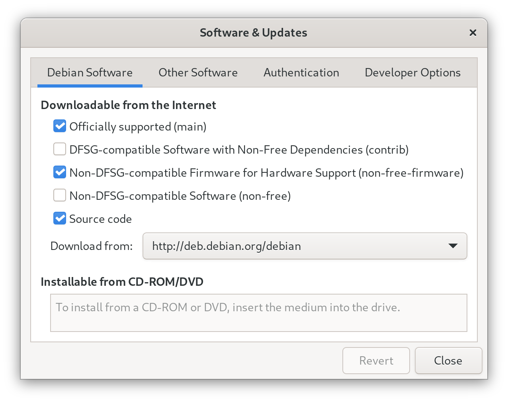

# Developer Workstation Setup Script Debian Edition


This guide provides instructions for setting up a developer workstation using Debian 12 "Bookworm" or 13 "Trixie" (currently unreleased, but in hard freeze). The Ansible playbook automates the installation of software and configurations. Your version of Debian is detected, and the best package options are chosen for you.

While the software and setup choices are mainly aimed towards developers, it is also suitable for general use.

## Installation

Before running the playbook, follow these steps to install Debian:

### Installing Debian 12 Bookworm or 13 Trixie Testing

You can use the testing installer until Trixie is released this summer:

https://cdimage.debian.org/images/daily-builds/daily/current/amd64/iso-cd/debian-testing-amd64-netinst.iso

> [!NOTE]
> - Do not provide any details for the root account, your user account will then have administrative rights.
> - Leave Gnome as the default desktop environment.
> - If you installed from a DVD ISO use the Software & Updates application or the terminal to remove `cdrom` from `/etc/apt/sources.list`. Look in Other Software:
> 

> [!NOTE]
> There is a bug in the Debian 12 installer, if you use the default guided partitioner, you will get a swap partition of only 1 GB regardless of how much RAM you have. To get an uncapped swap partition size, in the grub menu before the Debian installer runs, follow these steps:
>
> 1. Press "e" to edit the default installation option.
> 2. In the line that says `linux /install.amd/vmlinuz vga=788 --- quiet`, add the following separated by a space after `vmlinuz`:
>
>    ```sh
>    partman-auto/cap-ram=n
>    ```
>
> 3. Press Ctrl-x or F10 to continue.

## Setting up Debian

1. Open the terminal and run the following command to install Ansible, git, and Flatpak:
   ```sh
   sudo apt install ansible git flatpak
   ```

2. Clone this repository and navigate to it:
   ```sh
   git clone https://github.com/David-Else/developer-workstation-setup-script-debian
   cd developer-workstation-setup-script-debian
   ```

3. Customize the software selection by modifying `packages.yml` according to your preferences.

4. Run the main installation playbook:
> [!NOTE]
> When prompted for the `BECOME` password in Ansible, enter your user password. Your account must have administrative privileges.
>
> You can add `--check` for a test run or `--diff, -vv` to see more info.

   ```sh
   ansible-playbook ./install-playbook.yml -K
   ```

5. To enable the preview feature in the `nnn` file manager, run it once with the `-a` flag to create the FIFO file. Install the plugins with `sh -c "$(curl -Ls https://raw.githubusercontent.com/jarun/nnn/master/plugins/getplugs)"`.

6. Install showmethekey:

   ```sh
   cd extras
   unzip showmethekey-1.12.0-compiled.zip
   cd showmethekey-1.12.0
   sudo ./install-show-me-the-key.sh
   ```

7. Install Firefox extensions:

   ```sh
   firefox https://addons.mozilla.org/en-GB/firefox/addon/ublock-origin/ \
       https://addons.mozilla.org/en-US/firefox/addon/surfingkeys_ff/ \
       https://addons.mozilla.org/en-US/firefox/addon/keepassxc-browser/ &
   ```

8. Compile tt terminal typing test from source:

   ```sh
   git clone https://github.com/lemnos/tt
   cd tt
   make && sudo make install
   ```

9. Downgrade the MPV config file for Debian 12 if needed:

```sh
profile=gpu-hq
hwdec=auto-safe
fullscreen=yes
input-gamepad=yes
osd-font-size=25
```

10. Change the visudo editor to vim: `sudo update-alternatives --config editor`

11. Install Rust and AIChat:

```sh
    set -o pipefail &&
    curl --proto '=https' --tlsv1.2 -sSf https://sh.rustup.rs | sh -s -- -y &&
    . "$HOME/.cargo/env" &&
    rustup component add rust-analyzer &&
    cargo install aichat --version 0.29.0
    sudo cp ./extras/_aichat /usr/share/zsh/vendor-completions/
```

11. `sudo reboot`

## Optional Tweaks

Depending on your software selection, hardware, and personal preferences, you may want to make the following changes:

### Audio

You can confirm the allowed sample rate settings were changed by the playbook with `pw-metadata -n settings` and watch the sample rates change per application running `pw-top`.

> [!NOTE]
> More info can be found at: [docs.pipewire.org configuration-file-pipewireconf](https://gitlab.freedesktop.org/pipewire/pipewire/-/wikis/Config-PipeWire#configuration-file-pipewireconf)

### General

To perform general tweaks, follow these steps:

- Set Helix to open in Kitty, the desktop file [should use absolute paths](https://docs.helix-editor.com/building-from-source.html#configure-the-desktop-shortcut) if it lives in `~/.local/share/applications/`:

   ```sh
   Exec=/home/user/.local/kitty.app/bin/kitty --single-instance /home/david/.cargo/bin/hx %F
   Icon=/home/user/.icons/helix.png
   ```

- Configure Git email and name:
  ```sh
  git config --global user.email "you@example.com"
  git config --global user.name "Your Name"
  ```
  Enable GPG signing for commits:
  ```sh
  git config --global user.signingkey key
  git config --global commit.gpgsign true
  ```

- Install extras:
  ```sh
  gh extension install yusukebe/gh-markdown-preview
  gh extension install dlvhdr/gh-dash
  hx ~/.config/gh-dash/config.yml # diff: "delta"
  ```
-  `sudo apt install v4l2loopback-dkms v4l2loopback-utils` for virtual video devices

## FAQ

If you would like to use Code for things that Helix still struggles with (like debugging), and still use all the modal keyboard shortcuts, I suggest installing `silverquark.dancehelix` or `asvetliakov.vscode-neovim` and using these settings:
```jsonc
{
  // font size
  "editor.fontSize": 15,
  "markdown.preview.fontSize": 15,
  "terminal.integrated.fontSize": 15,
  // asvetliakov.vscode-neovim
  "editor.scrollBeyondLastLine": false,
  "vscode-neovim.neovimExecutablePaths.linux": "/usr/local/bin/nvim", // for el9 clones, or "/usr/bin/nvim" for Fedora
  "workbench.list.automaticKeyboardNavigation": false,
  // various
  "window.titleBarStyle": "custom", // adjust the appearance of the window title bar for linux
  "editor.minimap.enabled": false, // controls whether the minimap is shown
  "workbench.activityBar.visible": false, // controls the visibility of the activity bar in the workbench
  "window.menuBarVisibility": "hidden", // control the visibility of the menu bar
  "files.restoreUndoStack": false, // don't restore the undo stack when a file is reopened
  "editor.dragAndDrop": false, // controls whether the editor should allow moving selections via drag and drop
  "telemetry.enableTelemetry": false, // disable diagnostic data collection
}
```
You might also like to install `ms-vscode.live-server` for live debugging in Code or the browser.

If you get no bootable device found after installing Debian, try https://itsfoss.com/no-bootable-device-found-ubuntu/. Basically, add `shimx64.efi` as trusted EFI file to be executed.
> [!NOTE]
> Bonus: If you are using gnome-boxes don't forget to install `spice-vdagent` only on the guest AND restart the virtual machine to get copy and paste working. You can check it is running with `sudo systemctl status spice-vdagent` and enable at boot if needed with `sudo systemctl enable spice-vdagent`.

### Updating from Bookworm to Trixie

If you already have a clean installation of Bookworm and want to update to Trixie before using this playbook:

1. Check you have about 5 gig free disk space with `df -h`
2. `sudo apt-get update && sudo apt-get dist-upgrade --autoremove -y`
3. `sudo sed -i 's/bookworm/trixie/g' /etc/apt/sources.list`
4. `sudo apt-get update && sudo apt-get dist-upgrade --autoremove -y`

